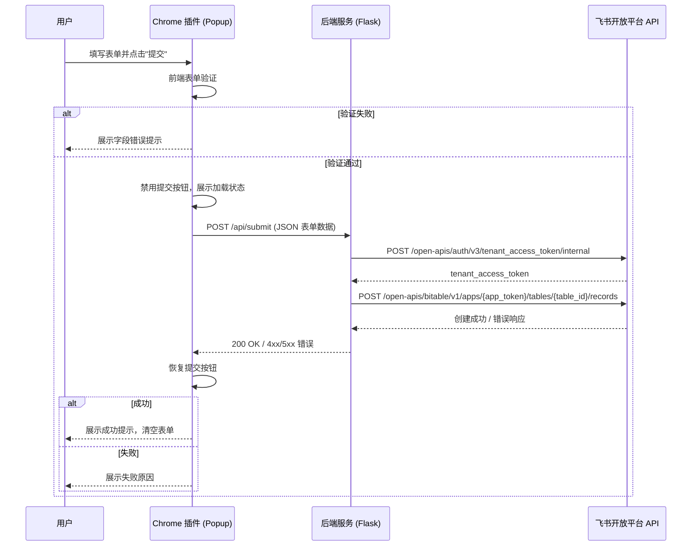

# 技术设计文档：飞书多维表格 Chrome 插件

## 概述

本系统由两个主要部分组成：一个 Chrome 浏览器扩展（Popup 界面）和一个轻量级后端服务。用户通过插件弹窗填写问题信息，点击提交后，插件将数据发送至后端服务，后端负责与飞书开放平台 API 通信，将记录写入指定的多维表格。

飞书认证凭据（`app_id`、`app_secret`）及表格配置（`app_token`、`table_id`）仅存储于后端，不暴露给前端插件，从而保证敏感信息安全。

### 技术选型

| 层次 | 技术 |
|------|------|
| Chrome 插件 | Manifest V3，原生 HTML/CSS/JavaScript（无框架，保持轻量） |
| 后端服务 | Python 3.10+ + Flask（轻量 HTTP 服务） |
| 飞书 API | 飞书开放平台 REST API v3（`tenant_access_token` 认证） |
| 部署 | 后端可部署于任意支持 Python 的环境（本地、云服务器等） |

---

## 架构

系统采用三层架构：Chrome 插件（前端）→ 后端服务 → 飞书开放平台 API。



### 部署架构

```
┌─────────────────────────────────────────────────────┐
│  用户浏览器                                           │
│  ┌─────────────────────────────────────────────┐    │
│  │  Chrome 插件 (Manifest V3)                   │    │
│  │  popup.html / popup.js / popup.css           │    │
│  └──────────────────┬──────────────────────────┘    │
└─────────────────────┼───────────────────────────────┘
                      │ HTTP POST (JSON)
                      ▼
┌─────────────────────────────────────────────────────┐
│  后端服务 (Python + Flask)                           │
│  - 接收插件请求                                       │
│  - 管理 tenant_access_token（含缓存与刷新）           │
│  - 拼接 Task_Detail 字段                             │
│  - 调用飞书 Bitable API                              │
│  - 硬编码 / 环境变量存储认证信息                       │
└──────────────────────┬──────────────────────────────┘
                       │ HTTPS
                       ▼
┌─────────────────────────────────────────────────────┐
│  飞书开放平台 API                                     │
│  - /open-apis/auth/v3/tenant_access_token/internal  │
│  - /open-apis/bitable/v1/apps/.../tables/.../records│
└─────────────────────────────────────────────────────┘
```

---

## 组件与接口

### 1. Chrome 插件（前端）

#### 文件结构

```
extension/
├── manifest.json          # Manifest V3 配置
├── popup.html             # 弹窗 HTML 结构
├── popup.js               # 表单逻辑、验证、API 调用
└── popup.css              # 样式
```

#### manifest.json 关键配置

```json
{
  "manifest_version": 3,
  "name": "飞书问题记录",
  "version": "1.0.0",
  "action": {
    "default_popup": "popup.html",
    "default_title": "提交问题到飞书"
  },
  "permissions": [],
  "host_permissions": [
    "http://localhost:3000/*"
  ]
}
```

> `host_permissions` 在生产环境中替换为实际后端服务地址。

#### popup.html 表单结构

表单包含四个必填字段及一个提交按钮：

| 字段 ID | 标签文字 | 类型 |
|---------|---------|------|
| `creator` | 创建人 | `<input type="text">` |
| `userIssue` | 用户问题 | `<textarea>` |
| `issueCause` | 问题原因 | `<textarea>` |
| `issueSolution` | 问题解决办法 | `<textarea>` |
| `submitBtn` | 提交 | `<button type="submit">` |

#### popup.js 核心逻辑

```
validateForm(formData) → { valid: boolean, errors: Record<fieldId, string> }
submitForm(formData) → Promise<{ success: boolean, message: string }>
showLoading() / hideLoading()
showSuccess(message) / showError(message)
clearForm()
```

**提交流程：**
1. 监听提交按钮点击事件
2. 调用 `validateForm`，若失败则展示错误并终止
3. 禁用提交按钮，展示加载状态
4. 调用后端 `POST /api/submit`，设置 10 秒超时（`AbortController`）
5. 根据响应展示成功/失败提示
6. 成功时清空表单；失败时保留输入内容
7. 恢复提交按钮

---

### 2. 后端服务（Python + Flask）

#### 文件结构

```
backend/
├── requirements.txt       # Python 依赖
├── .env                   # 环境变量（不提交到版本控制）
├── .env.example           # 环境变量模板
├── .gitignore
├── app.py                 # Flask 应用入口
├── config.py              # 读取环境变量配置
├── routes/
│   └── submit.py          # POST /api/submit 路由
├── services/
│   ├── feishu_auth.py     # tenant_access_token 获取与缓存
│   └── bitable.py         # 飞书 Bitable API 调用
└── utils/
    └── format_record.py   # Task_Detail 字段拼接逻辑
```

#### API 接口定义

**POST /api/submit**

请求体（JSON）：
```json
{
  "creator": "张三",
  "userIssue": "用户无法登录",
  "issueCause": "密码策略变更未通知用户",
  "issueSolution": "重置密码并发送通知邮件"
}
```

成功响应（HTTP 200）：
```json
{
  "success": true,
  "recordId": "recXXXXXXXX"
}
```

失败响应（HTTP 4xx/5xx）：
```json
{
  "success": false,
  "error": "FEISHU_API_ERROR",
  "message": "飞书 API 返回错误：..."
}
```

**错误码定义：**

| 错误码 | HTTP 状态 | 含义 |
|--------|-----------|------|
| `VALIDATION_ERROR` | 400 | 请求体字段缺失或格式错误 |
| `AUTH_ERROR` | 502 | 无法获取飞书 Access Token |
| `FEISHU_API_ERROR` | 502 | 飞书 Bitable API 返回错误 |
| `INTERNAL_ERROR` | 500 | 后端内部未预期错误 |

#### feishu_auth.py — Token 管理

飞书 `tenant_access_token` 有效期为 2 小时。后端在内存中缓存 token 及其过期时间，在 token 过期前 5 分钟主动刷新，避免每次请求都重新获取。

```
get_access_token() → str
  - 若缓存有效，直接返回缓存 token
  - 否则调用飞书 /open-apis/auth/v3/tenant_access_token/internal 获取新 token
  - 更新缓存（存储 token + 过期时间戳）
```

Token 缓存使用模块级字典存储：
```python
_token_cache = {
    "token": None,
    "expires_at": 0  # Unix 时间戳（秒）
}
```

飞书获取 Token 接口：
- **URL**: `POST https://open.feishu.cn/open-apis/auth/v3/tenant_access_token/internal`
- **Body**: `{ "app_id": "...", "app_secret": "..." }`
- **响应**: `{ "code": 0, "tenant_access_token": "...", "expire": 7200 }`

#### bitable.py — 写入记录

飞书创建记录接口：
- **URL**: `POST https://open.feishu.cn/open-apis/bitable/v1/apps/{app_token}/tables/{table_id}/records`
- **Header**: `Authorization: Bearer {tenant_access_token}`
- **Body**:
```json
{
  "fields": {
    "创建人": "张三",
    "用户问题": "用户无法登录",
    "问题原因": "密码策略变更未通知用户",
    "问题解决办法": "重置密码并发送通知邮件",
    "任务详情描述": "【用户问题】用户无法登录\n【问题原因】密码策略变更未通知用户\n【问题解决办法】重置密码并发送通知邮件"
  }
}
```

> **注意**：飞书多维表格字段名称需与实际表格中的字段名完全一致（区分大小写）。

#### format_record.py — Task_Detail 拼接

```python
def format_task_detail(user_issue: str, issue_cause: str, issue_solution: str) -> str:
    return f"【用户问题】{user_issue}\n【问题原因】{issue_cause}\n【问题解决办法】{issue_solution}"
```

---

## 数据模型

### 前端表单数据（FormData）

```typescript
interface FormData {
  creator: string;       // 创建人，必填，非空
  userIssue: string;     // 用户问题，必填，非空
  issueCause: string;    // 问题原因，必填，非空
  issueSolution: string; // 问题解决办法，必填，非空
}
```

### 后端提交请求体（SubmitRequest）

```typescript
interface SubmitRequest {
  creator: string;
  userIssue: string;
  issueCause: string;
  issueSolution: string;
}
```

| 多维表格字段名 | 来源 | 说明 |
|--------------|------|------|
| 创建人 | `creator` | 直接映射 |
| 用户问题 | `userIssue` | 直接映射 |
| 问题原因 | `issueCause` | 直接映射 |
| 问题解决办法 | `issueSolution` | 直接映射 |
| 任务详情描述 | 后端拼接 | `format_task_detail()` 生成 |

### 后端配置（Config）

```python
# config.py — 使用 python-dotenv 读取环境变量
@dataclass
class FeishuConfig:
    app_id: str       # 飞书应用 App ID（环境变量 FEISHU_APP_ID）
    app_secret: str   # 飞书应用 App Secret（环境变量 FEISHU_APP_SECRET）
    app_token: str    # 多维表格 App Token（环境变量 FEISHU_APP_TOKEN）
    table_id: str     # 数据表 ID（环境变量 FEISHU_TABLE_ID）

@dataclass
class ServerConfig:
    port: int         # 服务端口，默认 5000
    api_key: str      # 插件请求鉴权 Key（环境变量 API_KEY）
```

### Token 缓存（TokenCache）

```python
# feishu_auth.py — 模块级字典缓存
_token_cache: dict = {
    "token": None,
    "expires_at": 0  # Unix 时间戳（秒）
}
```

---

## 正确性属性

*属性（Property）是在系统所有有效执行中都应成立的特征或行为——本质上是对系统应做什么的形式化陈述。属性是人类可读规范与机器可验证正确性保证之间的桥梁。*

### 属性 1：表单验证的完备性

*对于任意*四字段表单数据，`validateForm` 函数的行为必须满足：若所有字段均为非空白字符串，则返回 `valid: true`；若任意字段为空字符串或纯空白字符串（仅含空格、制表符、换行符），则返回 `valid: false` 且 `errors` 对象中包含该字段的错误信息。

**验证：需求 2.1、2.2、2.3**

---

### 属性 2：Task_Detail 拼接格式不变性

*对于任意* `user_issue`、`issue_cause`、`issue_solution` 字符串（包含特殊字符、多行文本、Unicode 字符），`format_task_detail` 函数生成的字符串必须严格等于：
```
【用户问题】{user_issue}\n【问题原因】{issue_cause}\n【问题解决办法】{issue_solution}
```
即三个固定前缀标签、各字段内容原样嵌入、字段间以单个换行符分隔，无任何额外字符。

**验证：需求 4.4**

---

### 属性 3：飞书记录字段映射正确性

*对于任意*合法的 `SubmitRequest`（四个非空字段），后端向飞书 Bitable API 发送的 `fields` 对象必须同时满足以下五个条件：
1. `创建人` 字段值严格等于 `creator`
2. `用户问题` 字段值严格等于 `userIssue`
3. `问题原因` 字段值严格等于 `issueCause`
4. `问题解决办法` 字段值严格等于 `issueSolution`
5. `任务详情描述` 字段值严格等于 `format_task_detail(user_issue, issue_cause, issue_solution)` 的返回值

**验证：需求 3.1、4.2、4.4**

---

### 属性 4：未授权请求被拒绝

*对于任意*不携带有效 API Key 的 HTTP 请求（API Key 缺失、为空或与配置值不匹配），后端服务必须返回 HTTP 401 或 403 状态码，且不执行任何飞书 API 调用。

**验证：需求 6.3**

---

## 错误处理

### 前端错误处理

| 场景 | 处理方式 |
|------|---------|
| 必填字段为空 | 在字段旁展示红色错误提示文字，阻止提交 |
| 网络请求失败（fetch 异常） | 展示"网络错误，请检查网络连接"提示 |
| 后端返回 4xx/5xx | 解析响应体中的 `message` 字段并展示 |
| 请求超时（10 秒） | 使用 `AbortController` 中止请求，展示"请求超时，请稍后重试" |
| 重复提交防护 | 提交期间禁用提交按钮，请求完成后恢复 |

### 后端错误处理

| 场景 | 处理方式 |
|------|---------|
| 请求体字段缺失 | 返回 400 `VALIDATION_ERROR` |
| 飞书 Token 获取失败 | 返回 502 `AUTH_ERROR`，记录错误日志 |
| 飞书 API 返回非 0 code | 返回 502 `FEISHU_API_ERROR`，附带飞书错误信息 |
| 飞书 API 网络超时 | 设置 8 秒超时，超时后返回 502 |
| 未预期异常 | 返回 500 `INTERNAL_ERROR`，记录完整堆栈日志 |

### Token 刷新策略

- Token 有效期 2 小时（飞书返回 `expire: 7200`）
- 缓存过期前 5 分钟（即 `expiresAt - 300000ms`）触发主动刷新
- 若刷新失败，返回 `AUTH_ERROR` 给调用方，不使用过期 token

---

## 测试策略

### 单元测试

重点覆盖以下模块：

**前端（popup.js）：**
- `validateForm`：空字符串、纯空格、正常输入的各种组合
- 提交按钮状态管理（加载中禁用、完成后恢复）
- 成功/失败/超时的 UI 状态变化

**后端（format_record.py）：**
- `format_task_detail`：各种字符串输入（含特殊字符、换行符、Unicode）
- 输出格式严格符合规范

**后端（feishu_auth.py）：**
- Token 缓存命中逻辑
- Token 过期判断与刷新触发
- 飞书 API 调用失败时的错误传播

**后端（routes/submit.py 路由）：**
- 请求体验证逻辑
- 字段映射正确性（使用 mock 的 bitable 服务）

### 属性测试（Property-Based Testing）

使用 **hypothesis**（Python PBT 库）对以下属性进行测试，每个属性最少运行 **100 次迭代**：

**属性 1：表单验证的完备性**
- 生成器（拒绝路径）：随机生成四字段数据，其中至少一个字段为空字符串或纯空白字符串
- 生成器（通过路径）：随机生成四个非空白字符串
- 断言：空白字段时 `validateForm` 返回 `valid: false` 且 `errors` 包含对应字段；全填写时返回 `valid: true`
- 标签：`Feature: feishu-bitable-chrome-extension, Property 1: 表单验证的完备性`

**属性 2：Task_Detail 拼接格式不变性**
- 生成器：随机生成任意 `user_issue`、`issue_cause`、`issue_solution` 字符串（含特殊字符、多行文本、Unicode）
- 断言：输出严格等于 `f"【用户问题】{user_issue}\n【问题原因】{issue_cause}\n【问题解决办法】{issue_solution}"`
- 标签：`Feature: feishu-bitable-chrome-extension, Property 2: Task_Detail 拼接格式不变性`

**属性 3：飞书记录字段映射正确性**
- 生成器：随机生成合法的 `SubmitRequest`（四个非空字段）
- 断言：使用 `unittest.mock` mock 飞书 API，验证传入的 `fields` 对象中五个字段均正确映射（含 Task_Detail 计算值）
- 标签：`Feature: feishu-bitable-chrome-extension, Property 3: 飞书记录字段映射正确性`

**属性 4：未授权请求被拒绝**
- 生成器：随机生成不匹配配置 API Key 的请求头（随机字符串、空值、缺失）
- 断言：使用 Flask test client，后端返回 401，且 mock 的飞书 API 未被调用
- 标签：`Feature: feishu-bitable-chrome-extension, Property 4: 未授权请求被拒绝`

### 集成测试

- 后端与飞书 API 的端到端连通性测试（使用测试表格）
- 完整提交流程测试：插件 → 后端 → 飞书（沙箱环境）
- 使用 `pytest` + Flask test client 进行后端路由集成测试

### 手动测试

- 在 Chrome 中加载未打包插件，验证 UI 交互
- 验证各错误场景的用户提示文案
- 验证提交成功后表单清空行为
